<a href="https://www.leandro-cortes.com">
  <picture>
    <source media="(prefers-color-scheme: dark)" srcset="./assets/generated/hero-dark.svg">
    
  </picture>
</a>

  <a href="https://www.leandro-cortes.com"><picture><source media="(prefers-color-scheme: dark)" srcset="./assets/generated/btn-portfolio-dark.svg"></picture></a>&nbsp;
  <a href="https://www.linkedin.com/in/leandro-cort%C3%A9s-6a0311191/"><picture><source media="(prefers-color-scheme: dark)" srcset="./assets/generated/btn-linkedin-dark.svg"></picture></a>&nbsp;
  <a href="mailto:leandrocort47@gmail.com"><picture><source media="(prefers-color-scheme: dark)" srcset="./assets/generated/btn-email-dark.svg"></picture></a>

  <picture><source media="(prefers-color-scheme: dark)" srcset="./assets/generated/now-dark.svg">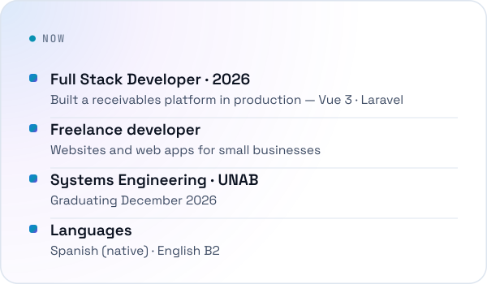</picture>
  <a href="https://www.leandro-cortes.com"><picture><source media="(prefers-color-scheme: dark)" srcset="./assets/generated/availability-dark.svg"></picture></a>

  <a href="https://www.leandro-cortes.com/projects/cartera-dpjd"><picture><source media="(prefers-color-scheme: dark)" srcset="./assets/generated/project-cartera-dark.svg">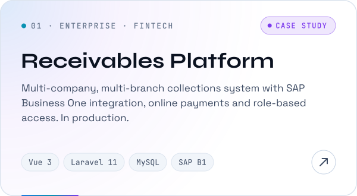</picture></a>
  <a href="https://www.leandro-cortes.com"><picture><source media="(prefers-color-scheme: dark)" srcset="./assets/generated/project-portfolio-dark.svg">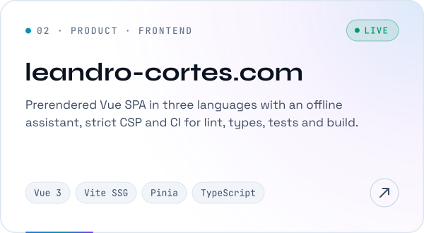</picture></a>

  <a href="https://github.com/Leocort47/ProyectodeGradoPropIA"><picture><source media="(prefers-color-scheme: dark)" srcset="./assets/generated/project-aria-dark.svg">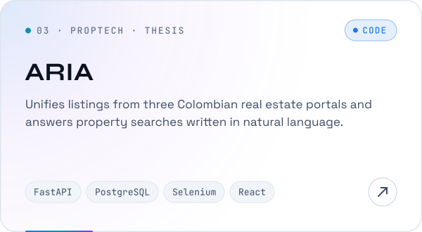</picture></a>
  <a href="https://coronado-barbershop.com"><picture><source media="(prefers-color-scheme: dark)" srcset="./assets/generated/project-coronado-dark.svg">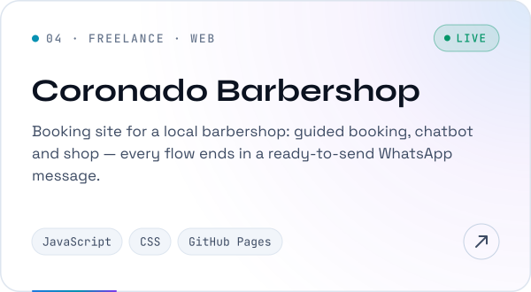</picture></a>

<picture>
  <source media="(prefers-color-scheme: dark)" srcset="./assets/generated/stack-dark.svg">
  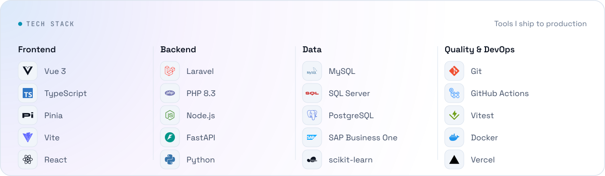
</picture>

  <picture><source media="(prefers-color-scheme: dark)" srcset="./assets/generated/stats-dark.svg">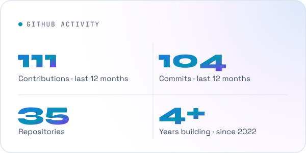</picture>
  <picture><source media="(prefers-color-scheme: dark)" srcset="./assets/generated/languages-dark.svg">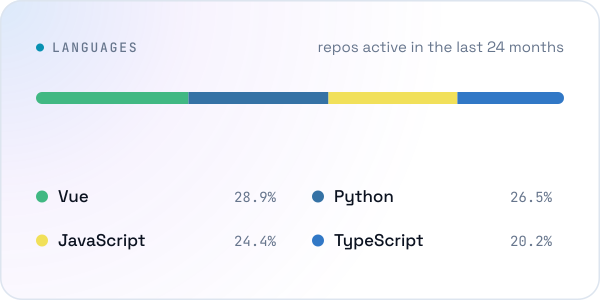</picture>

<picture>
  <source media="(prefers-color-scheme: dark)" srcset="./assets/generated/activity-dark.svg">
  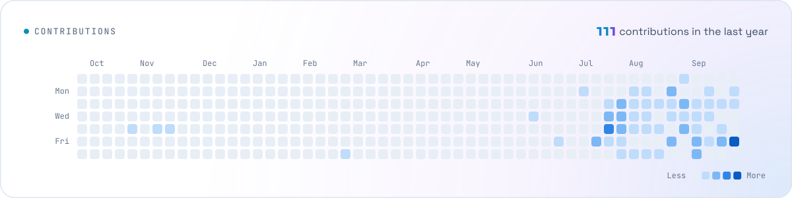
</picture>

<b>How I work</b>

 

- **Business first** — I start from the real workflow (who collects, who approves, who pays) before designing tables or screens.
- **End to end** — schema, API, UI, permissions and deployment.
- **Ship safely** — role-based access, input validation, secrets out of the repo, and CI that blocks broken builds.
- **Honest metrics** — I describe what a system does, not invented percentages.

<b>Earlier work — university & learning path</b>

 

These repositories show how I got here:

- **Android (Java)** — wallet app: [MyWalletLEANDRO](https://github.com/Leocort47/MyWalletLEANDRO) · [Wallet](https://github.com/Leocort47/Wallet) · [Wallet-Leandro](https://github.com/Leocort47/Wallet-Leandro)
- **Ionic + Angular + Capacitor** — mobile app with a data preprocessing notebook: [AppLanguage](https://github.com/Leocort47/AppLanguage)
- **Machine learning** — churn prediction: [An-lisis-Predictivo-de-Churn](https://github.com/Leocort47/An-lisis-Predictivo-de-Churn) · product recognition: [PrediccionProductosIA](https://github.com/Leocort47/PrediccionProductosIA)
- **Laravel / PHP** — backend course projects: [202306-backend-project](https://github.com/Leocort47/202306-backend-project) · [backend](https://github.com/Leocort47/backend)
- **Unity (C#)** — multimedia video game: [Godo-f-Notes](https://github.com/Leocort47/Godo-f-Notes) · [god-notes](https://github.com/Leocort47/god-notes)
- **Data structures (Java)** — gym management app: [EstructuraDatos](https://github.com/Leocort47/EstructuraDatos)
- **Python foundations (2022)** — [Projects](https://github.com/Leocort47/Projects) · [Retos-programacion](https://github.com/Leocort47/Retos-programacion) · [BuscaminasProject](https://github.com/Leocort47/BuscaminasProject) · [WeatherApp](https://github.com/Leocort47/WeatherApp)

<b>En español</b>

 

Soy **desarrollador Full Stack** con foco en **Vue 3** y **Laravel**. En 2026 diseñé y construí desde cero el sistema de cartera y cobranza de Distribuciones Pastor Julio Delgado / Mensulí (práctica profesional), hoy en producción, y en paralelo trabajo como **freelance**. Estudio **Ingeniería de Sistemas en la UNAB** y me gradúo en **diciembre de 2026**. Inglés **B2**.

Busco roles **Junior / Mid Full Stack** o **Frontend Vue**, remoto o híbrido. Casos de estudio completos en **[leandro-cortes.com](https://www.leandro-cortes.com)**.

Every card on this page is an SVG generated by <a href="./scripts/build.mjs">a small Node.js pipeline</a> in this repository and refreshed daily by GitHub Actions — no third-party widgets.
